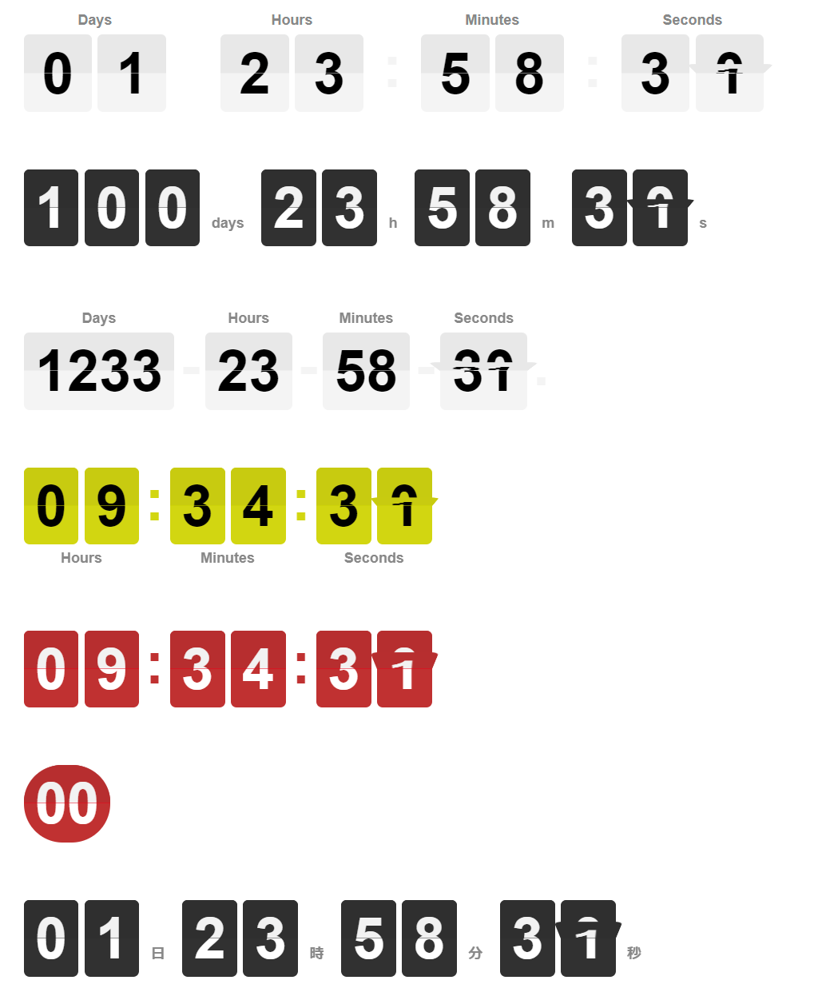

This project a forked project from [https://github.com/PButcher/flipdown](https://github.com/PButcher/flipdown) The original project was created by [PButcher](https://github.com/PButcher/flipdown).

# FlipDown.js Jake's edition 2024

⏰ A lightweight and performant flip styled countdown clock.

I rewrote the source code in TypeScript and LESS CSS for some extensions which are listed in the feature list.

<div style="text-align:center;"></div>


## Features

- 💡 Lightweight - No jQuery! <11KB minified bundle
- ⚡ Performant - Animations powered by CSS transitions
- 📱 Responsive - Works great on screens of all sizes
- 🎨 Themeable - Choose from built-in themes, or add your own
- 🌍 i18n - Customisable headings for your language

### In addition to the original version, Jake's edition features the following

- more Responsive - restructured using CSS Flexbox so the size fits and stretches along the drawing container.
- more digits on **Days** rotor. Grouping digits in one rotor.
- auto hide preceding zeros.
- on/off heading labels and locations selectable.

Respecting the original edition of FlipDown, usage of Javascript class and HTML structure are preserved as much as possible.

## Example

Example live at: https://jakejp.github.io/flipdown/example/

## Get started

#### 1. Include the [CSS and JS](https://github.com/JakeJP/flipdown/tree/master/dist) in `<head>` and include the following line in your HTML.

```html
<link rel="stylesheet" type="text/css" href="css/flipdown/flipdown.css">
<script type="text/javascript" src="js/flipdown/flipdown.js"></script>
```

```html
<div id="flipdown" class="flipdown"></div>
```

#### 2. insert a bit of Javascript. FlipDown takes a Date or unix timestamp (in seconds) to countdown to as an argument.

```javascript
new FlipDown(1538137672).start();
```

```javascript
new FlipDown(new DateTime(2024, 12,25)).start();
```


See a full example [here](https://github.com/JakeJP/flipdown/tree/master/example).

## Multiple Instances

To use multiple instances of FlipDown on the same page, specify a DOM element ID as the second argument in FlipDown's constructor:

```javascript
new FlipDown(1588017373, "registerBy").start();
new FlipDown(1593561600, "eventStart").start();
```

```html
<div id="registerBy" class="flipdown"></div>
<div id="eventStart" class="flipdown"></div>
```

## Themes

FlipDown comes with 5 themes as predfined:

- dark [default]
- light
- green
- yellow
- red

To set the theme, you can supply the `theme` property in the `opt` object in the constructor with the theme name as a string.

For example, to instantiate FlipDown using the light theme instead:

```javascript
new FlipDown(1538137672, {
  theme: "light",
}).start();
```

colors and other styles can be customized as described in the next section.

### Custom stylings

#### 1. `class` attribute of FlipDown element

`flipdown` is a must to set.

`responsive` is an option to make the containing element stretchable using Flexbox's flex-grow.

```html
<div class='flipdown responsible'></div>
```

#### 2. `style` attribute of FlipDown element

Some styling can be done with style attribute on the flipdown element.

- `color` `font-family` `font-size` defines font of text elements.
- `--flip-color` defines theme color of flips (direct option besides `theme`).
- `--corner-radius` for corners of flips.
- `--flip-sleed` to define the flip speed. Default is `0.5s`

```html
  <div class="flipdown" style="color: black; --flip-color: red; --corner-radius: 1em; --flip-speed: 0.2s; "></div>
```

#### 3. Option arguments in `new FlipDown(... { options })`

##### `headings` and `headingsAt`

specifies heading visibility or text. Pass 4 element array to customize day, hour, min, sec part of heading labels. `false` to hide.

`headingAt` can be one of `top` , `bottom`, `left` or `right` to specify where the heading label should sit.

Suggested use is for i18n. Usage as follows:

```javascript
new FlipDown(1538137672, {
  headings: ["Nap", "Óra", "Perc", "Másodperc"],
  headingsAt: 'bottom'
}).start();
```

Note that headings will default to English if not provided: `["Days", "Hours", "Minutes", "Seconds"]` and `headingsAt` `top`

```javascript
new FlipDown(1538137672, { headings: false }).start();
```
##### `rotor`

`1` to group digits for each D H M S instead of assigning a rotor to each number.

##### `tick`

`tick` specifies a callback function, which is called every time FlipDown flips.

##### `ended`

`ended` is called when FlipDown reaches the end of countdown. (Same time as IfEnded )

```javascript
new FlipDown(1538137672, {
  headings: ['D', 'H', 'M', 'S'],
  headingsAt: 'right',
  rotor: 1,
  tick: function(){

  },
  ended: function(){

  }
}).start();
```

#### 4. Further styling options ( more direct )

Some of sub elements in FlipDown can be stylized by using actual CSS selector.

- `.flipdown .delimiter` to customize the delimiter text which is usually `:` between digit groups.
- `.flipdown .rotor-group-heading` to customize the heading labels which are usually `Days` `Hours`...
- `.flipdown .digit` to select text element in each rotor element for adjusting font or padding.

```css
  .flipdown .digit {
    padding: 0.6em;
  }
```

Heading text can be styled with `.flipdown .rotor-group-heading` selector.

```css
  .flipdown .rotor-group-heading {
    font-size: 0.6em;
  }
```

## API

### `FlipDown(uts, [el], [opts])`

Create a new FlipDown instance.

#### Parameters

##### `uts`

Type: _number_

The unix timestamp to count down to (in seconds).

##### `[el]`

**Optional**  
Type: _string_ (default: `flipdown`)

The DOM element ID to attach this FlipDown instance to. Defaults to `flipdown`.

##### `[opts]`

**Optional**  
Type: _object_ (default: `{}`)

Optionally specify additional configuration settings. Currently supported settings include:

- [`theme`](#Themes)
- [`headings`](#Headings)
- `headingsAt` top | bottom | left | right
- `rotor` `1` to group digits in one rotor.
- [`tick`](#tick)
- [`ended`](#ended)

### `FlipDown.start()`

Start the countdown.

### `FlipDown.ifEnded(callback)`

Call a function once the countdown has ended.

#### Parameters

##### `callback`

Type: _function_

Function to execute once the countdown has ended.

#### Example

```javascript
var flipdown = new FlipDown(1538137672)

  // Start the countdown
  .start()

  // Do something when the countdown ends
  .ifEnded(() => {
    console.log("The countdown has ended!");
  });
```
## How to build js and css

Build configuration is not included in the project. But the original code is just 2 files:

- **flipdown.ts** - TypeScript source code should be compiled in `.js` then `.min.js` by minifier
- **flipdown.less** - LESS CSS file should be compiled in `.css` and `.min.css`  by minifier

## Acknowledgements

Special thanks to the original project.

- [@PButcker](https://github.com/PButcher) for the orignal project which my project is based on.

Thanks to the following people for their suggestions/fixes:

- [@chuckbergeron](https://github.com/chuckbergeron) for his help with making FlipDown responsive.
- [@vasiliki-b](https://github.com/vasiliki-b) for spotting and fixing the Safari backface-visibility issue.
- [@joeinnes](https://github.com/joeinnes) for adding i18n to rotor group headings.
